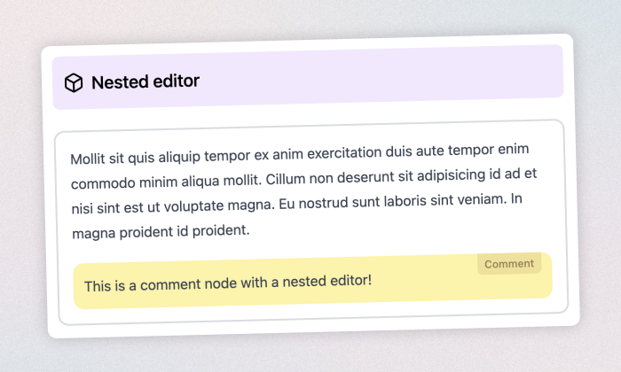

# `lexical-examples`

#### The missing examples library for [lexical.dev](https://lexical.dev/).

Lexical has only been released quite recently. It was built with a composability mindset, similar to React. This allows you to do all sorts of interesting patterns.

This repository should exemplify these patterns and hopefully be a helpful resource for developers getting their heads around Lexical.

### [🕹️ Playground](https://lexical-examples-demo.vercel.app/)

### [🗂 Example directory](https://github.com/konstantinmuenster/lexical-examples/tree/main/examples) 

Every example is reduced to the bare minimum and can be executed on its own. I only ceated a few utility packages to share common functionalities and UI elements.

## Development

Running a specific example locally:

```bash
# Clone the repository
git clone https://github.com/konstantinmuenster/lexical-examples.git
cd lexical-examples

# Install dependencies
yarn

# Run the shared packages and a specified example in development
# (swap out `lexical-nested-editor` if you want to run another example)
yarn dev --filter='./shared/*' --filter=lexical-nested-editor
```

## About

<a href="https://www.buymeacoffee.com/kmuenster" target="_blank"></a>

Konstantin Münster – [konstantin.digital](https://konstantin.digital)
